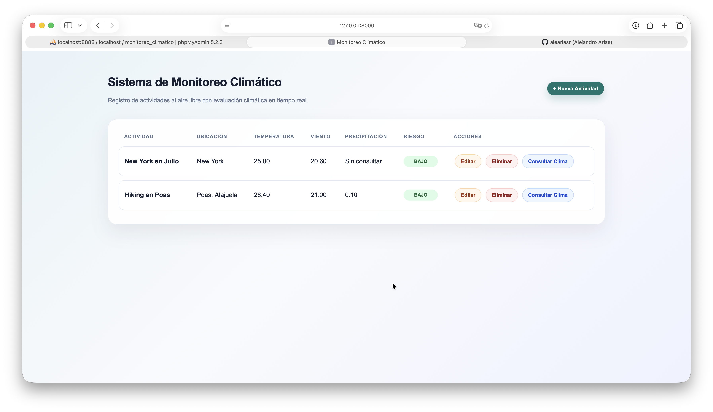

# Sistema de Monitoreo Climático

Proyecto desarrollado en Django y MySQL para registrar actividades al aire libre, consultar información climática en tiempo real mediante la API Open-Meteo y calcular el nivel de riesgo climático mediante un procedimiento almacenado en MySQL.

## Captura de Pantalla



## Características

- CRUD completo de actividades
- Consumo de API REST Open-Meteo
- Procedimiento almacenado MySQL
- Cálculo automático de riesgo climático
- Diseño responsivo con CSS
- Colores automáticos según nivel de riesgo

## Tecnologías utilizadas

- Python
- Django
- MySQL
- PyMySQL
- Requests
- HTML
- CSS
- API Open-Meteo

## Funcionalidades

- Registrar actividades al aire libre.
- Consultar actividades registradas.
- Editar actividades.
- Eliminar actividades.
- Consultar clima en tiempo real usando latitud y longitud.
- Guardar temperatura, velocidad del viento y precipitación.
- Calcular riesgo climático mediante procedimiento almacenado.
- Mostrar colores automáticos según el riesgo:
  - Verde: BAJO
  - Amarillo: MEDIO
  - Rojo: ALTO

## Procedimiento almacenado

El sistema utiliza el procedimiento `sp_calcular_riesgo_climatico`, que recibe temperatura, velocidad del viento y precipitación.

La lógica aplicada es:

- Si la precipitación es mayor a 20, el riesgo es ALTO.
- Si la velocidad del viento es mayor a 40, el riesgo es ALTO.
- Si la temperatura es mayor a 35, el riesgo es MEDIO.
- En cualquier otro caso, el riesgo es BAJO.

## Consumo de API

Al presionar el botón "Consultar Clima", Django toma la latitud y longitud de la actividad, consume la API Open-Meteo, interpreta el JSON recibido y guarda los datos climáticos en la base de datos.

## IA utilizada

Herramienta utilizada: ChatGPT.

## Prompts utilizados

1. Ayúdame a crear un laboratorio en Django y MySQL para registrar actividades al aire libre y consultar clima con Open-Meteo.
2. Cómo puedo consumir una API REST desde una vista de Django y guardar los datos en MySQL.
3. Cómo crear e invocar un procedimiento almacenado de MySQL desde Django para calcular un nivel de riesgo.

## Cómo ayudó la IA

La IA ayudó a estructurar el proyecto Django, consumir la API Open-Meteo, invocar el procedimiento almacenado desde Django y mejorar la presentación visual con CSS.

## Ejecución del proyecto

1. Crear entorno virtual:

```bash
python3 -m venv venv
source venv/bin/activate